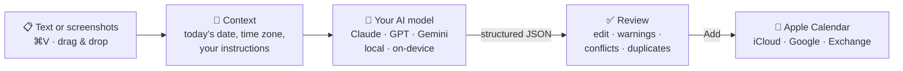

<div align="center">

<a id="top"></a>


# calto

**Turn screenshots and text into Apple Calendar events: paste, review, add.**

A native macOS menu bar app. Paste an invitation, a chat, a poster or a schedule;
an AI model of your choice finds the events; you check them and add them to any calendar.

[](https://github.com/NickCool0/calto/releases/latest)
[](https://github.com/NickCool0/calto/actions/workflows/ci.yml)
[](#requirements)
[](Packages/CaltoKit)
[](LICENSE)

**English** · [Русский](README.ru.md)

<a href="https://github.com/NickCool0/calto/releases/latest/download/calto.dmg">
  
</a>

</div>

> [!NOTE]
> calto is in active development: recognition, review and undo work; history is next.
> See the [roadmap](#roadmap).

<details>
<summary><b>Table of contents</b></summary>

- [Features](#features)
- [How it works](#how-it-works)
- [Install](#install)
- [Usage](#usage)
- [AI providers](#ai-providers)
- [Privacy](#privacy)
- [FAQ](#faq)
- [Roadmap](#roadmap)
- [Build from source](#build-from-source)
- [Acknowledgments](#acknowledgments)
- [License](#license)

</details>

## Features

- 📋 **Paste anything**: screenshots, images and text with <kbd>⌘</kbd><kbd>V</kbd>, or drag them onto the popover.
- 🧠 **Bring your own AI**: Claude, GPT, Gemini, any OpenAI-compatible server (Ollama, LM Studio, OpenRouter) or Apple's on-device model.
- 🗓️ **Understands dates like a person**: "tomorrow at 1 pm", "every Monday until June", time zones, all-day events, reminders, meeting links.
- ✅ **Nothing is saved without you**: review every event, fix any field, pick the calendar, then add. Undo is one click.
- ⚠️ **Flags what's uncertain**: ambiguous dates, time conflicts, likely duplicates and Exchange's one-reminder limit.
- ☁️ **Every calendar you already have**: iCloud, Google, Exchange: whatever is set up in Apple Calendar.
- 🔒 **Private by design**: no telemetry, no backend; keys in the Keychain; screenshots can stay on your Mac.
- 🍎 **Native**: SwiftUI + AppKit, Liquid Glass popover, English and Russian, zero third-party dependencies.

## How it works



The model returns events in a strict JSON schema with local times; calto converts them into real
dates in your time zone, checks them against your calendars, and shows them for review.

## Install

### Requirements

macOS 27 on Apple silicon.

### Download

1. Download **[calto.dmg](https://github.com/NickCool0/calto/releases/latest/download/calto.dmg)** from the
   [latest release](https://github.com/NickCool0/calto/releases/latest), open it and drag **calto** into **Applications**.
2. calto is free and open source but not notarized by Apple, so allow it **once**:

> [!IMPORTANT]
> Open calto, then go to **System Settings → Privacy & Security** and click **Open Anyway**.
> Or run this in Terminal:
> ```sh
> xattr -dr com.apple.quarantine /Applications/calto.app
> ```

3. On first launch, allow access to your calendars.
4. Click the calto icon in the menu bar → ⚙︎ and set up an [AI provider](#ai-providers).

## Usage

| Shortcut | Action |
|---|---|
| <kbd>⌃</kbd><kbd>⌥</kbd><kbd>⌘</kbd><kbd>C</kbd> | Open calto from any app |
| Click the menu bar icon | Open calto · right-click for the menu |
| <kbd>⌘</kbd><kbd>V</kbd> | Paste a screenshot, image or text |
| <kbd>⌘</kbd><kbd>↩</kbd> | Recognize · add the reviewed events |
| <kbd>⌘</kbd><kbd>,</kbd> | Settings |
| <kbd>Esc</kbd> | Close (your input is kept) |

1. Paste or drop what you have: a screenshot of a chat, a poster, an email, or just type
   *"Lunch with Anna tomorrow at 1 pm"*.
2. Optionally add an instruction: *"only the meetings with Anna"*, *"remind me an hour before"*.
3. Press **Recognize**, check the cards, change anything, and click **Add to Calendar**.

> [!TIP]
> Put things you always want into **Settings → Prompt**, such as *"work meetings go to the Work calendar"* or
> *"write titles in English"*. They are added to every request.

Defaults for new events (calendar, reminder, duration when no end is given) are in **Settings → General**.

## AI providers

Choose a provider in **Settings → Model**, paste a key and press **Check Key and Load Models**.
Keys are stored only in the macOS Keychain, one per provider, so you can switch between them.

| Provider | Key | Reads screenshots | Where your input goes |
|---|---|---|---|
| **Anthropic** (Claude) | [console.anthropic.com](https://console.anthropic.com/settings/keys) | ✅ | Anthropic |
| **OpenAI** | [platform.openai.com](https://platform.openai.com/api-keys) | ✅ | OpenAI |
| **Google Gemini** | [aistudio.google.com](https://aistudio.google.com/apikey) | ✅ | Google |
| **OpenRouter** | [openrouter.ai/keys](https://openrouter.ai/keys) · address `https://openrouter.ai/api/v1` | ✅ with vision models | OpenRouter and the model's host |
| **Ollama** / **LM Studio** / osaurus | not needed · `http://localhost:11434/v1` / `http://localhost:1234/v1` | ✅ with vision models, otherwise via on-device OCR | Stays on your Mac |
| **Apple Intelligence** | not needed | via on-device OCR | Stays on your Mac |

<details>
<summary><b>Running a local model with Ollama</b></summary>

```sh
brew install ollama
ollama serve &
ollama pull qwen2.5vl        # a model that can read images
```

In calto: **Settings → Model → OpenAI-compatible**, address `http://localhost:11434/v1`, then
**Check Key and Load Models** and pick the model.

</details>

## Privacy

- **No telemetry, analytics or backend.** calto talks only to the provider you choose, or to nobody
  with a local or on-device model.
- **API keys live in the macOS Keychain**, never in files or preferences.
- **Screenshots are downscaled and stripped of metadata** (EXIF, GPS) before they are sent.
- **Settings → Model → Always read screenshots on this Mac** recognizes text locally with Vision and
  sends only the text.
- **Calendar data never leaves your Mac.** It's read only to warn about conflicts and duplicates.

## FAQ

<details>
<summary><b>macOS says calto can't be opened or is damaged</b></summary>

The app is ad-hoc signed and not notarized. Allow it once in **System Settings → Privacy & Security → Open Anyway**,
or run `xattr -dr com.apple.quarantine /Applications/calto.app`.
</details>

<details>
<summary><b>After an update macOS asks for calendar or Keychain access again</b></summary>

Every build has a new ad-hoc signature, so macOS treats it as a new app. Allow access once more.
</details>

<details>
<summary><b>Which model should I choose?</b></summary>

For screenshots, choose a model that reads images; fast, inexpensive models (Gemini Flash, Claude Haiku, GPT mini)
work well for invitations and chats. If a model can't read images, calto recognizes the text on your Mac and sends
that instead.
</details>

<details>
<summary><b>Why was only one reminder saved?</b></summary>

Exchange calendars keep a single reminder per event. calto warns you on the review screen and saves the first one.
</details>

<details>
<summary><b>⌃⌥⌘C does nothing</b></summary>

Another app may own the shortcut. The calto menu (right-click the icon) says so if the shortcut couldn't be registered.
</details>

<details>
<summary><b>How do I uninstall calto?</b></summary>

Quit calto and move it to the Trash. To remove its data too: delete the `calto:` items in **Keychain Access** and run
`defaults delete io.github.nickcool0.calto`.
</details>

## Roadmap

- [x] Menu bar app, calendar access, CI and DMG releases
- [x] Input: paste, drag and drop, instruction, global shortcut
- [x] Settings: providers, API keys in the Keychain, model list, your own prompt, defaults
- [x] Recognition with Claude, OpenAI, Gemini, OpenAI-compatible servers and Apple's on-device model
- [x] Review screen with conflict and duplicate warnings; undo
- [ ] History of recognized and created events
- [ ] Customizable global shortcut
- [ ] Screenshots in this README

## Build from source

Requires Xcode 27.

```sh
git clone https://github.com/NickCool0/calto.git && cd calto
swift test --package-path Packages/CaltoKit      # recognition, dates, time zones: no network needed
xcodebuild -project calto.xcodeproj -scheme calto -configuration Release -derivedDataPath build clean build
open build/Build/Products/Release/calto.app
```

Debug builds include a **Mock** provider for working on the UI without an API key.

<details>
<summary><b>Project structure</b></summary>

| Path | Contents |
|---|---|
| `calto/` | The app: menu bar item, popover, review screen, settings, EventKit, Vision, Foundation Models |
| `Packages/CaltoKit/` | Pure Swift core: prompts, provider requests and responses, date resolution, checks; Swift Testing |
| `Config/` | `Info.plist` and App Sandbox entitlements |
| `scripts/generate-icon.py` | Renders the app and menu bar icons (Python standard library only) |
| `scripts/verify-bundle.sh` | Checks the built app for sandbox, entitlements, usage descriptions, icons |
| `.github/workflows/ci.yml` | Clean build and tests on every push; manual or tag releases with a DMG |

</details>

Releases: **Actions → CI → Run workflow**, enter a version such as `0.4.0`. The workflow builds, tags and publishes
the DMG.

## Acknowledgments

- Inspired by [Smart Calendars AI](https://www.smartcalendars.ai/); calto covers its text and screenshot to event part.
- Agent skills from [fayazara/macos-app-skills](https://github.com/fayazara/macos-app-skills) (MIT) helped build it.

## License

[MIT](LICENSE) © NickCool0 and calto contributors

<div align="right"><a href="#top">Back to top ↑</a></div>
