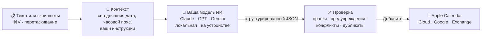

<div align="center">

<a id="top"></a>


# calto

**Скриншоты и текст — в события Apple Calendar: вставил, проверил, добавил.**

Нативное приложение для строки меню macOS. Вставьте приглашение, переписку, афишу или расписание —
выбранная вами модель ИИ найдёт события, а вы проверите их и добавите в любой календарь.

[](https://github.com/NickCool0/calto/releases/latest)
[](https://github.com/NickCool0/calto/actions/workflows/ci.yml)
[](#требования)
[](Packages/CaltoKit)
[](LICENSE)

[English](README.md) · **Русский**

<a href="https://github.com/NickCool0/calto/releases/latest/download/calto.dmg">
  
</a>

</div>

> [!NOTE]
> calto активно развивается: распознавание, проверка и отмена работают, следующая — история.
> См. [планы](#планы).

<details>
<summary><b>Содержание</b></summary>

- [Возможности](#возможности)
- [Как это работает](#как-это-работает)
- [Установка](#установка)
- [Использование](#использование)
- [Провайдеры ИИ](#провайдеры-ии)
- [Приватность](#приватность)
- [Вопросы и ответы](#вопросы-и-ответы)
- [Планы](#планы)
- [Сборка из исходников](#сборка-из-исходников)
- [Благодарности](#благодарности)
- [Лицензия](#лицензия)

</details>

## Возможности

- 📋 **Вставляйте что угодно**: скриншоты, изображения и текст через <kbd>⌘</kbd><kbd>V</kbd> или перетаскиванием в окно.
- 🧠 **Свой ИИ**: Claude, GPT, Gemini, любой OpenAI-совместимый сервер (Ollama, LM Studio, OpenRouter) или модель Apple на устройстве.
- 🗓️ **Понимает даты по-человечески**: «завтра в 13», «каждый понедельник до июня», часовые пояса, «весь день», напоминания, ссылки на созвоны.
- ✅ **Ничего не сохраняется без вас**: проверьте каждое событие, исправьте любое поле, выберите календарь, добавьте. Отмена — в один клик.
- ⚠️ **Отмечает сомнительное**: неоднозначные даты, пересечения по времени, вероятные дубликаты и лимит Exchange в одно напоминание.
- ☁️ **Все ваши календари**: iCloud, Google, Exchange — всё, что подключено в Apple Calendar.
- 🔒 **Приватность по умолчанию**: без телеметрии и своего сервера; ключи — в Связке ключей; скриншоты могут не покидать Mac.
- 😀 **Понятно с первого взгляда**: по умолчанию название начинается с подходящего эмодзи (🚬, 🛒, 💼); это меняется в Настройки → Промпт.
- 🍎 **Нативное**: SwiftUI + AppKit, поповер Liquid Glass, русский и английский (переключается в настройках), ни одной сторонней зависимости.

## Как это работает



Модель возвращает события по строгой JSON-схеме с локальным временем. calto переводит его в точные даты
в вашем часовом поясе, сверяет с вашими календарями и показывает на проверку.

## Установка

### Требования

macOS 27 на Apple silicon.

### Скачивание

1. Скачайте **[calto.dmg](https://github.com/NickCool0/calto/releases/latest/download/calto.dmg)** из
   [последнего релиза](https://github.com/NickCool0/calto/releases/latest), откройте его и перетащите **calto** в **Программы**.
2. calto бесплатный и с открытым кодом, но не нотаризован Apple, поэтому разрешите его запуск **один раз**:

> [!IMPORTANT]
> Откройте calto, затем **Системные настройки → Конфиденциальность и безопасность → «Всё равно открыть»**.
> Или выполните в Терминале:
> ```sh
> xattr -dr com.apple.quarantine /Applications/calto.app
> ```

3. При первом запуске разрешите доступ к календарям.
4. Нажмите на иконку calto в строке меню → ⚙︎ и настройте [провайдера ИИ](#провайдеры-ии).

## Использование

| Сочетание | Действие |
|---|---|
| <kbd>⌃</kbd><kbd>⌥</kbd><kbd>⌘</kbd><kbd>C</kbd> | Открыть calto из любого приложения |
| Клик по иконке в строке меню | Открыть calto · правый клик — меню |
| <kbd>⌘</kbd><kbd>V</kbd> | Вставить скриншот, изображение или текст |
| <kbd>⌘</kbd><kbd>↩</kbd> | Создать события (кнопка ↑) · добавить проверенные события |
| <kbd>⌘</kbd><kbd>,</kbd> | Настройки |
| <kbd>Esc</kbd> | Закрыть (введённое сохраняется) |

1. Вставьте или перетащите то, что есть: скриншот переписки, афишу, письмо — или просто напишите
   *«Обед с Аней завтра в 13»*. Скриншоты появляются миниатюрами над текстом.
2. Инструкции пишите в то же поле: *«только встречи с Аней»*, *«напомни за 15 и за 30 минут»*.
3. Выберите календарь внизу окна, нажмите **↑** (<kbd>⌘</kbd><kbd>↩</kbd>), проверьте карточки, поправьте что нужно
   и нажмите **Добавить в Календарь**.

> [!TIP]
> То, что нужно всегда, запишите в **Настройки → Промпт**: например, *«рабочие встречи — в календарь „Работа“»*
> или *«названия пиши по-русски»*. Это добавляется к каждому запросу.

Значения по умолчанию для новых событий (календарь, напоминание, длительность, если конец не указан) —
в **Настройки → Основные**.

## Провайдеры ИИ

Выберите провайдера в **Настройки → Модель**, вставьте ключ и нажмите **Проверить ключ и загрузить модели**.
Ключи хранятся только в Связке ключей macOS, отдельно для каждого провайдера, поэтому между ними можно переключаться.

| Провайдер | Ключ | Читает скриншоты | Куда уходят данные |
|---|---|---|---|
| **Anthropic** (Claude) | [console.anthropic.com](https://console.anthropic.com/settings/keys) | ✅ | Anthropic |
| **OpenAI** | [platform.openai.com](https://platform.openai.com/api-keys) | ✅ | OpenAI |
| **Google Gemini** | [aistudio.google.com](https://aistudio.google.com/apikey) | ✅ | Google |
| **OpenRouter** | [openrouter.ai/keys](https://openrouter.ai/keys) · адрес `https://openrouter.ai/api/v1` | ✅ у моделей с поддержкой изображений | OpenRouter и хостинг модели |
| **Ollama** / **LM Studio** / osaurus | не нужен · `http://localhost:11434/v1` / `http://localhost:1234/v1` | ✅ у моделей с поддержкой изображений, иначе через OCR на устройстве | Остаются на вашем Mac |
| **Apple Intelligence** | не нужен | через OCR на устройстве | Остаются на вашем Mac |

<details>
<summary><b>Локальная модель через Ollama</b></summary>

```sh
brew install ollama
ollama serve &
ollama pull qwen2.5vl        # модель, которая понимает изображения
```

В calto: **Настройки → Модель → OpenAI-совместимый**, адрес `http://localhost:11434/v1`, затем
**Проверить ключ и загрузить модели** и выберите модель.

</details>

## Приватность

- **Никакой телеметрии, аналитики и своего сервера.** calto общается только с выбранным вами провайдером —
  или ни с кем, если модель локальная или на устройстве.
- **API-ключи хранятся в Связке ключей macOS**, а не в файлах или настройках.
- **Скриншоты уменьшаются и очищаются от метаданных** (EXIF, GPS) перед отправкой.
- **Настройки → Модель → Всегда распознавать скриншоты на этом Mac**: текст распознаётся локально через Vision,
  и отправляется только он.
- **Данные календаря не покидают Mac.** Они читаются только для предупреждений о конфликтах и дубликатах.

## Вопросы и ответы

<details>
<summary><b>macOS пишет, что calto нельзя открыть или он повреждён</b></summary>

Приложение подписано ad-hoc и не нотаризовано. Разрешите запуск один раз: **Системные настройки →
Конфиденциальность и безопасность → «Всё равно открыть»**, или выполните `xattr -dr com.apple.quarantine /Applications/calto.app`.
</details>

<details>
<summary><b>После обновления macOS снова просит доступ к календарю или Связке ключей</b></summary>

У каждой сборки новая ad-hoc подпись, и macOS считает её новым приложением. Разрешите доступ к календарю ещё раз.
Когда macOS спросит пароль Связки ключей для API-ключа, нажмите **Разрешать всегда**: просто **Разрешить** будет
спрашивать при каждом запуске. calto читает ключ один раз за запуск и держит его в памяти.
</details>

<details>
<summary><b>⌘V не вставляет скриншот</b></summary>

Щёлкните в текстовое поле и нажмите <kbd>⌘</kbd><kbd>V</kbd> или кнопку вставки внизу слева. Начиная с macOS 15.4
приложения могут без запроса читать буфер обмена только при вставке, поэтому calto читает его только в этот момент.
Если вы скопировали файл в Finder, добавляются только изображения.
</details>

<details>
<summary><b>Какую модель выбрать?</b></summary>

Для скриншотов нужна модель, которая понимает изображения; быстрые недорогие модели (Gemini Flash, Claude Haiku,
GPT mini) хорошо справляются с приглашениями и перепиской. Если модель не понимает изображения, calto распознаёт текст
на вашем Mac и отправляет его.
</details>

<details>
<summary><b>Почему сохранилось только одно напоминание?</b></summary>

Календари Exchange хранят одно напоминание на событие. calto предупреждает об этом на экране проверки и сохраняет первое.
</details>

<details>
<summary><b>⌃⌥⌘C не работает</b></summary>

Возможно, сочетание занято другим приложением. Меню calto (правый клик по иконке) сообщит, если его не удалось зарегистрировать.
</details>

<details>
<summary><b>Как удалить calto?</b></summary>

Завершите calto и перенесите его в Корзину. Чтобы удалить и данные: удалите записи `calto:` в **Связке ключей** и выполните
`defaults delete io.github.nickcool0.calto`.
</details>

## Планы

- [x] Приложение в строке меню, доступ к календарю, CI и релизы в DMG
- [x] Ввод: одно поле для текста, инструкций и скриншотов; вставка, перетаскивание, глобальная горячая клавиша
- [x] Настройки: провайдеры, API-ключи в Связке ключей, список моделей, свой промпт, значения по умолчанию
- [x] Распознавание через Claude, OpenAI, Gemini, OpenAI-совместимые серверы и модель Apple на устройстве
- [x] Экран проверки с предупреждениями о конфликтах и дубликатах; отмена
- [ ] История распознанных и созданных событий
- [ ] Настраиваемая горячая клавиша
- [ ] Скриншоты в этом README

## Сборка из исходников

Нужен Xcode 27.

```sh
git clone https://github.com/NickCool0/calto.git && cd calto
swift test --package-path Packages/CaltoKit      # распознавание, даты, часовые пояса — без сети
xcodebuild -project calto.xcodeproj -scheme calto -configuration Release -derivedDataPath build clean build
open build/Build/Products/Release/calto.app
```

В Debug-сборках есть провайдер **Mock** для работы над интерфейсом без API-ключа.

<details>
<summary><b>Структура проекта</b></summary>

| Путь | Содержимое |
|---|---|
| `calto/` | Приложение: иконка в строке меню, поповер, экран проверки, настройки, EventKit, Vision, Foundation Models |
| `Packages/CaltoKit/` | Ядро на чистом Swift: промпты, запросы и ответы провайдеров, разбор дат, проверки; Swift Testing |
| `Config/` | `Info.plist` и entitlements песочницы |
| `scripts/generate-icon.py` | Рисует иконки приложения и строки меню (только стандартная библиотека Python) |
| `scripts/verify-bundle.sh` | Проверяет собранное приложение: песочница, entitlements, тексты запросов доступа, иконки |
| `.github/workflows/ci.yml` | Чистая сборка и тесты на каждый push; релизы вручную или по тегу, с DMG |

</details>

Релизы: **Actions → CI → Run workflow**, укажите версию, например `0.4.0`. Workflow соберёт приложение, поставит тег
и опубликует DMG.

## Благодарности

- Идея — [Smart Calendars AI](https://www.smartcalendars.ai/); calto реализует его часть «текст и скриншоты → события».
- В разработке помогли скиллы для агентов из [fayazara/macos-app-skills](https://github.com/fayazara/macos-app-skills) (MIT).

## Лицензия

[MIT](LICENSE) © NickCool0 и участники проекта calto

<div align="right"><a href="#top">Наверх ↑</a></div>
